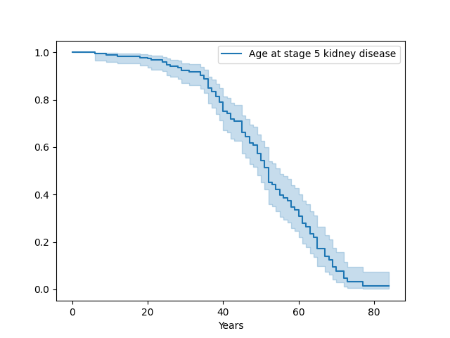
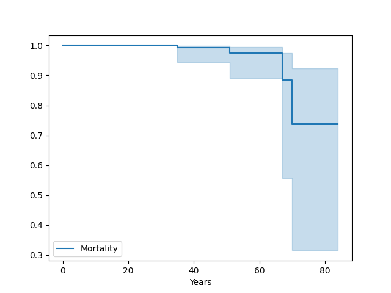

# Kaplan Meier Visualization

A brief introduction to Kaplan-Meier analysis is available [here](https://pubmed.ncbi.nlm.nih.gov/20723767/). The following texts were extracted from that article.

Time-to-event is a clinical course duration variable for each subject having a beginning and an end anywhere along the time line of the complete study. For example, it may begin when the subject is enrolled into a study or when treatment begins, and ends when the end-point (event of interest) is reached or the subject is censored from the study.  In preparing Kaplan-Meier survival analysis, each subject is characterized by three variables: 1) their serial time, 2) their status at the end of their serial time (event occurrence or censored), and 3) the study group they are in.  For the construction of survival time probabilities and curves, the serial times for individual subjects are arranged from the shortest to the longest, without regard to when they entered the study. By this maneuver, all subjects within the group begin the analysis at the same point and all are surviving until something happens to one of them. The two things that can happen are: 1) a subject can have the event of interest or 2) they are censored.


| SUBJECT | SERIAL TIME (years) | STATUS AT SERIAL TIME (1=event; 0=censored) | Group (1 or 2) |
|---------|---------------------|---------------------------------------------|----------------|
| B       | 1                   | 1                                           | 1              |
| E       | 2                   | 1                                           | 1              |
| F       | 3                   | 1                                           | 1              |
| A       | 4                   | 1                                           | 1              |
| D       | 4.5                 | 1                                           | 1              |
| C       | 5                   | 0                                           | 1              |
| U       | 0.5                 | 1                                           | 2              |
| Z       | 0.75                | 1                                           | 2              |
| W       | 1                   | 1                                           | 2              |


Censoring means the total survival time for that subject cannot be accurately determined. This can happen when something negative for the study occurs, such as the subject drops out, is lost to follow-up, or required data is not available or, conversely, something good happens, such as the study ends before the subject had the event of interest occur, i.e., they survived at least until the end of the study, but there is no knowledge of what happened thereafter. Thus censoring can occur within the study or terminally at the end.

Currently, pyphetools shows a survival curve for the entire cohort. This is the corresponding Python code.
There are two options. First, we plot the time up to the event represented by the age of onset of an HPO term.

```python
from pyphetools.visualization import KaplanMeierVisualizer, PhenopacketIngestor, SimplePatient
from lifelines import KaplanMeierFitter
import matplotlib.pyplot as plt # only needed to save file 
phenopackets_dir = "../phenopackets/" # directory containing phenopackets to plot
ingestor = PhenopacketIngestor(indir=phenopackets_dir)
ppkt_list = ingestor.get_phenopacket_list()
simple_pt_list = [SimplePatient(ppkt) for ppkt in ppkt_list]
hpo_id = "HP:0003774" # TermId of HPO term for the KM plot
kmv = KaplanMeierVisualizer(simple_patient_list=simple_pt_list, target_tid=stage5crd)
T, E = kmv.get_time_and_event()
# plot Kaplan Meier curve
kmf = KaplanMeierFitter()
kmf.fit(T, E, label="Age at stage 5 kidney disease")
plt.plot()
ax = kmf.plot_survival_function()
ax.set_xlabel("Years");
plt.savefig("kmf_plot.png", format="png"); ## optional
```


<figure markdown>
{ width="1000" }
<figcaption>Kaplan Meier Survival Plot of a cohort of individuals with pathogenic variants in the UMOD gene with respect to age of onset of stage 5 kidney failure.
</figcaption>
</figure>
```

It is also possible to plot a curve for survival, which makes use of the VitalStatus message of the phenopackets. The code is exactly the same
as the above, except that we do not pass the target_tid argument.
```python
# same as above
kmv = KaplanMeierVisualizer(simple_patient_list=simple_pt_list)
# same as above except that we change the title of the plot
kmf.fit(T, E, label="Survival")
```


<figure markdown>
{ width="1000" }
<figcaption>Kaplan Meier Survival Plot of a cohort of individuals with pathogenic variants in the UMOD gene.
</figcaption>
</figure>